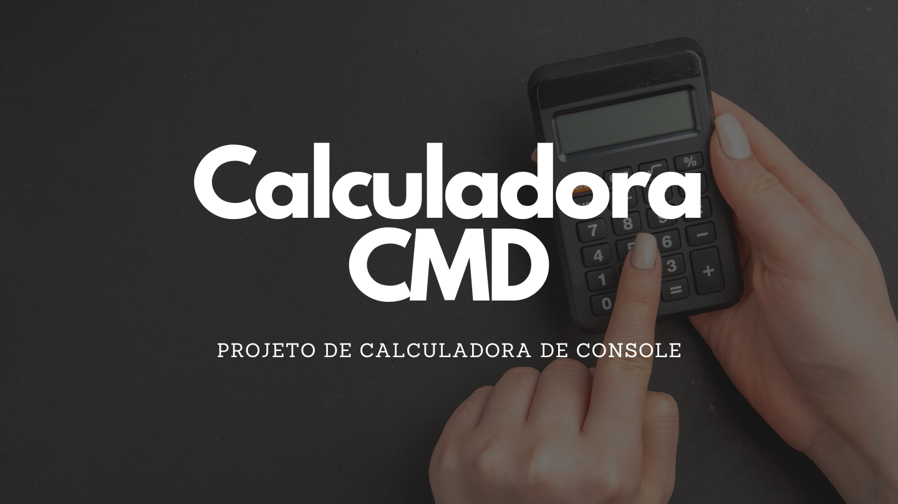

# CalculadoraCMD 🧮

> Projeto feito através de conhecimentos adquiridos através de cursos.

### Sobre

O aplicativo CalculadoraCMD é autoexplicativo, trata-se de uma calculadora de console que conta com as operações: adição, subtração, multiplicação, divisão, radiciação e exponenciação.

### Conhecimentos

Durante esse projeto pude aprofundar meus conhecimentos sobre os seguintes conteúdos:

- [x] C#
- [x] .NET Framework
- [x] Criação de funções
- [x] Comunicação com usuário
- [x] Tratamento de dados
- [x] Enum
- [x] Operações aritméticas
- [x] Classe math 
